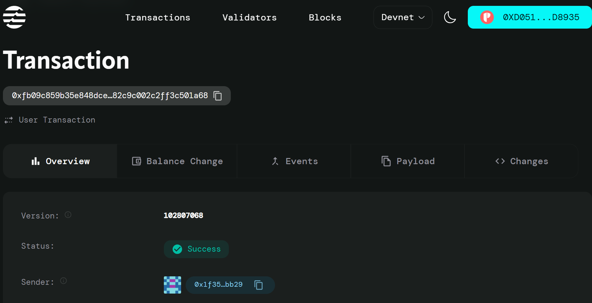

# EnergyTrading System - Aptos Move Smart Contract

A decentralized marketplace for peer-to-peer renewable energy trading, allowing producers to list surplus electricity and consumers to purchase it securely on the Aptos blockchain.

## 📋 Table of Contents
- Overview
- Features
- Contract Structure
- Functions
- Installation
- Usage
- Testing
- Deployment
- Trading Workflow
- Error Codes
- Contributing
- License

## 🔍 Overview

The EnergyTrading System is a Move smart contract deployed on Aptos Devnet that enables direct transactions between energy producers and consumers. Producers can list available surplus electricity, set prices per kWh, and receive payments in Aptos native coins. Consumers can browse and purchase energy directly from producers.

### Project Details
- **Language**: Move (Aptos)
- **Contract Size**: ~60 lines
- **Functions**: 3 main functions
- **Dependencies**: Aptos Framework
- **Network**: Aptos Devnet

## ✨ Features

- **Energy Listing** – Producers create listings with quantity (kWh) and price
- **Direct Purchase** – Consumers pay producers instantly on-chain
- **Ownership Tracking** – Maintains record of buyer and seller addresses
- **Listing Management** – Marks listings as sold once purchased
- **Secure Payments** – Utilizes Aptos coin transfers
- **On-Chain Records** – Fully transparent marketplace history
- **Interactive UI** – A modern React + Vite frontend dashboard for tracking available surplus energy
- **Petra Wallet Integration** – Direct, secure connection requiring the Petra wallet extension 
- **Demo Mode** – Explore the interface with mock wallet data for easy onboarding

## 🏗️ Contract Structure

### Data Structures

#### Listing
```move
struct Listing has store {
    id: u64,                          // Unique listing ID
    producer: address,                // Address of the seller
    kwh: u64,                         // Energy quantity in kWh
    price_per_kwh: u64,              // Price per kWh in Aptos coins
    remaining: u64,                   // Remaining energy for sale
    sold: bool,                       // Sale status
    buyer: option::Option<address>    // Optional buyer address
}
```

#### ProducerListings
```move
struct ProducerListings has key {
    list: vector<Listing>             // All listings created by a producer
}
```

## 🚀 Functions

### 1. init_producer_storage
**Purpose**: Initializes on-chain storage for a producer's listings.

**Parameters**:
- `producer: &signer` – Account creating the storage

**Usage**:
```move
EnergyTrading::init_producer_storage(producer);
```

### 2. list_surplus
**Purpose**: Creates a new electricity listing.

**Parameters**:
- `producer: &signer` – Seller account
- `kwh: u64` – Quantity of electricity in kWh
- `price_per_kwh: u64` – Price in Aptos coins per kWh

**Usage**:
```move
EnergyTrading::list_surplus(producer, 100, 2);
```

### 3. buy_listing
**Purpose**: Purchases electricity from a listing.

**Parameters**:
- `buyer: &signer` – Consumer account
- `producer_addr: address` – Seller address
- `listing_index: u64` – Index of the listing in seller's storage

**Usage**:
```move
EnergyTrading::buy_listing(buyer, 0x123..., 0);
```

## 💻 Installation

### Prerequisites

1. **Install Aptos CLI**:
   ```bash
   curl -fsSL "https://aptos.dev/scripts/install_cli.py" | python3
   ```

2. **Verify Installation**:
   ```bash
   aptos --version
   ```

### Setup Project

1. **Create Project Directory**:
   ```bash
   mkdir EnergyTradingSystem
   cd EnergyTradingSystem
   ```

2. **Initialize Aptos Project**:
   ```bash
   aptos init
   ```

3. **Create Folder Structure**:
   ```bash
   mkdir sources tests
   ```

4. **Create Move.toml**:
   ```toml
   [package]
   name = "EnergyTradingSystem"
   version = "1.0.0"
   authors = ["YourName <your.email@example.com>"]

   [addresses]
   MyModule = "_"

   [dependencies.AptosFramework]
   git = "https://github.com/aptos-labs/aptos-core.git"
   rev = "devnet"
   subdir = "aptos-move/framework/aptos-framework"
   ```

5. **Add Contract File**:
   Save the contract code as `sources/energy_trading.move`

## 📖 Usage

### Compile Contract
```bash
aptos move compile
```

### Run Tests
```bash
aptos move test
```

### Example Usage

1. **Initialize Producer Storage**:
   ```bash
   aptos move run \
     --function-id default::EnergyTrading::init_producer_storage
   ```

2. **List 100 kWh at 2 APT/kWh**:
   ```bash
   aptos move run \
     --function-id default::EnergyTrading::list_surplus \
     --args u64:100 u64:2
   ```

3. **Buy Listing 0 from Producer**:
   ```bash
   aptos move run \
     --function-id default::EnergyTrading::buy_listing \
     --args address:0xPRODUCER_ADDRESS u64:0
   ```

## 🧪 Testing

### Example Unit Test
```move
#[test_only]
module MyModule::TestEnergyTrading {
    use MyModule::EnergyTrading;
    use std::signer;

    #[test(producer = @0x1)]
    public fun test_listing(producer: &signer) {
        EnergyTrading::init_producer_storage(producer);
        EnergyTrading::list_surplus(producer, 50, 3);
    }
}
```

### Run Tests
```bash
aptos move test --verbose
```

## 🚀 Deployment

### Devnet Deployment
```bash
# Configure devnet profile
aptos init --profile devnet --network devnet

# Fund with faucet
aptos account fund-with-faucet --profile devnet

# Deploy to devnet
aptos move publish --profile devnet
```

## 📊 Trading Workflow

1. Producer initializes storage
2. Producer lists surplus energy
3. Consumer selects listing
4. Payment is transferred instantly
5. Listing marked as sold

## ⚠️ Error Codes

| Code | Constant | Description |
|------|----------|-------------|
| 1 | `E_STORAGE_NOT_INITIALIZED` | Producer storage not found |
| 2 | `E_LISTING_NOT_FOUND` | No listing at specified index |
| 3 | `E_ALREADY_SOLD` | Listing already purchased |

## 📈 Best Practices

- **Small Listings** – Break large energy amounts into smaller offers
- **Price Updates** – Adjust prices based on demand
- **Fast Purchases** – Listings are first-come, first-served
- **Verification** – Verify producer addresses before purchase

## 🤝 Contributing

1. Fork the repository
2. Create a feature branch
3. Make your changes
4. Add tests
5. Ensure all tests pass
6. Submit a PR

## 📄 License

MIT License

## 📞 Support

- Create an issue in the repo
- Check Aptos documentation
- Join Aptos Discord

---

**Built with ⚡ for the Aptos renewable energy marketplace**

### Contract Details
- **Devnet Address**: 
0xfb09c859b35e848dcedb76491724b2601ba7a00d3d4182c9c002c2ff3c501a68
- **Module Name**: `EnergyTrading`
- **Network**: Aptos Devnet
